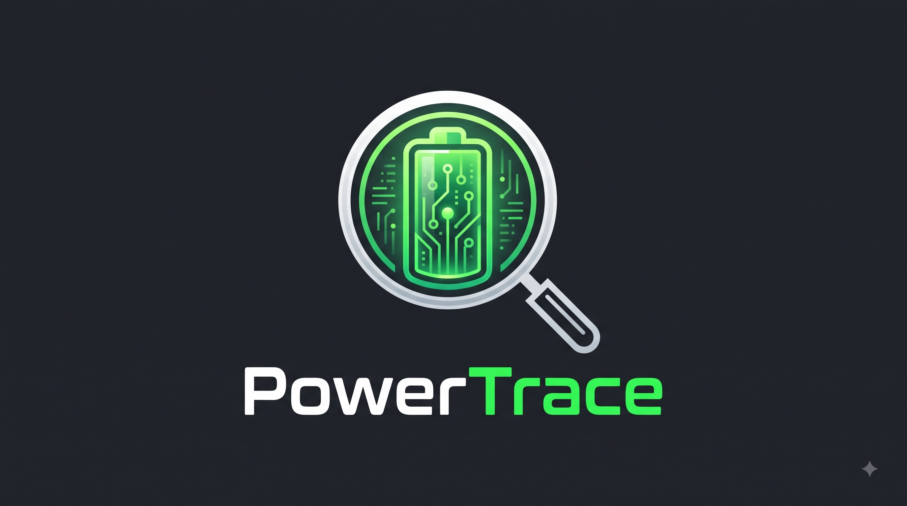

<p align="center">
  
</p>

<p align="center">
  <strong>Android battery telemetry and idle drain diagnostics tool.</strong>
</p>

<p align="center">
  
  
  
  
  <a href="https://github.com/SneakyZippy/PowerTrace/releases"></a>
</p>

---

## Overview

**PowerTrace** helps you find out what is actually draining your device's battery while the screen is off. 

Standard Android battery menus only show coarse, aggregated percentages. PowerTrace takes snapshots of Android's internal diagnostic sources (`batterystats`, `dumpsys alarm`, `dumpsys power`, and device power profiles) to break down battery loss across custom recording sessions—without requiring root access.

## Download

Get the latest build directly from GitHub:

- 📥 **[Download Latest APK (`PowerTrace-debug.apk`)](https://github.com/SneakyZippy/PowerTrace/releases/download/latest/PowerTrace-debug.apk)**
- Or browse all releases on the **[Releases](https://github.com/SneakyZippy/PowerTrace/releases)** page.

## Key Features

- **Session Recording**: Start a diagnostic session (e.g., overnight or during standby) and calculate deltas between baseline and completion.
- **Wakeup & Culprit Detection**: Pinpoints apps and processes causing excessive alarms, wakeups, partial wakelocks, and background CPU time.
- **Power Profile Attribution**: Estimates energy use (mAh) based on your device's OEM power profile hardware coefficients.
- **Auto-Stop Triggers**: Optionally end sessions automatically when you unlock the device or plug it into a charger.
- **Continuous Monitoring**: An optional background service to track periodic intervals throughout the day.
- **Diagnostics Export**: Export session snapshots as JSON or raw diagnostic checkins for debugging and bug reports.
- **Mock Diagnostic Mode**: Includes a built-in mock telemetry source so developers can inspect and test the UI without configuring ADB permissions.

## Setup & ADB Permissions

PowerTrace reads protected system stats that are not exposed to normal third-party apps by default. These can be granted once via ADB without rooting:

```bash
adb shell pm grant com.antigravity.battery android.permission.BATTERY_STATS
adb shell pm grant com.antigravity.battery android.permission.DUMP
adb shell pm grant com.antigravity.battery android.permission.PACKAGE_USAGE_STATS
adb shell appops set com.antigravity.battery GET_USAGE_STATS allow
```

*Note: If you don't have ADB available, you can toggle **Mock Diagnostic Mode** in the app settings to test all features with simulated data.*

## Tech Stack

- **UI**: Jetpack Compose, Material 3
- **Language**: Kotlin (Coroutines, Flow)
- **Architecture**: MVVM with unidirectional data flow
- **Storage**: Room SQLite database
- **Target SDK**: Android 14 (API 34) / Min SDK 26

## Building

Clone the repository and build with Gradle:

```bash
git clone https://github.com/SneakyZippy/PowerTrace.git
cd PowerTrace
./gradlew assembleDebug
```

You can then install the debug build directly to a connected device:

```bash
./gradlew installDebug
```

## License

This project is licensed under the terms of the GNU General Public License v3.0 ([GPL-3.0](LICENSE)).
